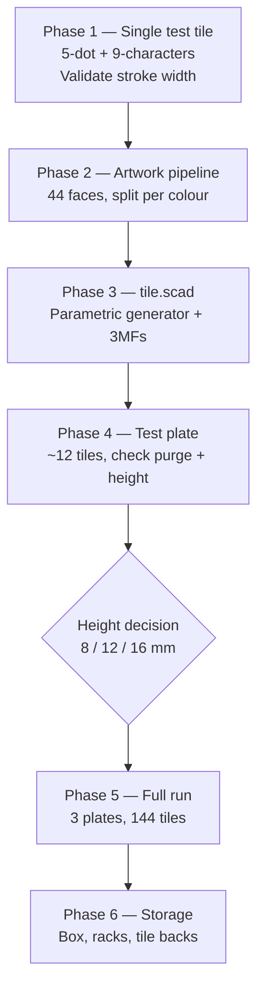

# Mahjong Tile Set

A full 144-tile mahjong set with classic symbols, printed on an Elegoo Centauri Carbon 2 with a 0.4 mm nozzle and the four-colour CANVAS system.

Status: **planning**. Nothing printed yet. This document is the design brief and roadmap.

**Confirmed:** Centauri Carbon 2 (CANVAS available) · wall-building set, so tiles must stand on edge · final tile height deferred, generator carries it as a parameter.

---

## 1. The idea

Generate the whole set parametrically rather than modelling 144 tiles by hand: take a CC0 vector tile set, convert each face to an SVG path, and feed it into an OpenSCAD generator that extrudes a tile body with the face inlaid or engraved. One `.scad` file plus 44 face SVGs produces every tile, and changing the tile thickness, corner radius, or face style is a parameter change rather than a remodel.

This reuses the pattern already built in [`openSCAD/Stencil Generator`](../../../openSCAD/) (SVG → 3D with beveled edges) and the artwork conventions in [`stencils`](../../../stencils/).

---

## 2. Tile height — parked, not decided

Wall-building is the goal, and the size is deferred. That combination is fine: **height is a single parameter in the generator, and nothing else in this plan depends on it.** The artwork, the stroke-width work, the colour strategy, and the face dimensions are all settled independently — so Phases 1–3 can run to completion before the number is chosen.

What the choice will be, when it comes up:

| Option | Height | Behaviour | Print cost (est.) |
| --- | --- | --- | --- |
| **A. Flat** | 3 mm | Lies flat; solitaire/travel only — **will not stand** | ~410 g, ~12–15 h |
| **B. Standard** | 16 mm | Full-size wall, correct heft (~18 g/tile) | ~2.2 kg, ~4–5 days |
| **C. Half-height** | 8 mm | Stands in a wall, half the print | ~1.1 kg, ~2 days |

**The one thing already ruled out is A.** At 3 mm a tile cannot stand on edge, so it cannot form a wall — the original 3 mm figure and wall-building are mutually exclusive. Everything below is therefore written for a standing tile, with **8 mm as the working default** until you pick: it stacks and stands reliably, halves the filament and the print time against a full-size set, and stays close enough to standard that the face geometry is unchanged.

Two consequences of a standing tile worth knowing now, neither of which blocks anything:

- **Print time and filament scale almost linearly with height** — the tile is 100 % infill, so 16 mm is ~5× the 3 mm figure. This is what makes B a multi-day job.
- **Tall tiles still print face-down.** Orientation does not change; the tile just gets taller. No supports either way.

**Do not scale the face down.** The 32 × 24 mm face is what makes the 0.4 mm nozzle viable — see §4 — and it is independent of height.

---

## 3. Printer notes

**Elegoo Centauri Carbon 2**, 0.4 mm nozzle, with the four-colour **CANVAS** system. 256 × 256 × 256 mm CoreXY, fully enclosed, 320 °C hardened nozzle, 110 °C bed.

(For the record, since it came up: there is no "Centauri Carbon 3." The line is the original Centauri Carbon, and the Centauri Carbon 2 / 2 Combo launched January 2026 — the CC2 is what adds CANVAS. CANVAS also shipped as a $55 add-on for the original in April 2026.)

This is the good case. Four colours resolves §5 outright — classic polychrome faces come off the plate finished, with no pauses, no filament swaps, and no hand-painting. The 256 mm bed takes a large plate of tiles, and the enclosure gives a stable chamber for a long multi-colour run.

---

## 4. Why the 0.4 mm nozzle works — but only at full face size

The binding constraint is the 萬 (*wàn*) character on the Characters suit: roughly 12 strokes stacked inside one glyph.

The rule of thumb for FDM text is that a stroke narrower than the extrusion width will not form, and **a stroke that gets fewer than two extrusion lines is likely to fail**. With a 0.4 mm nozzle at ~0.42 mm line width, that sets a floor of **≈ 0.85 mm minimum stroke width**.

| Face size | 萬 glyph height | Approx. stroke width (bold CJK) | Verdict |
| --- | --- | --- | --- |
| 32 × 24 mm | ~14 mm | ~1.0–1.2 mm | ✅ comfortable |
| 26 × 20 mm | ~11 mm | ~0.8–0.9 mm | ⚠️ marginal |
| 24 × 18 mm | ~10 mm | ~0.7–0.8 mm | ❌ strokes merge |

So: **keep the face at 32 × 24 mm**, use a heavy CJK weight (Noto Sans CJK Bold / Source Han Sans Heavy), and add a small outward offset to any glyph whose strokes measure under 0.85 mm. A 0.2 mm nozzle would lift the ceiling considerably, but at 144 tiles the print time makes that a poor trade.

Other geometry rules that follow from the nozzle:

- Inlay depth: **~0.5 mm** — 3 layers at 0.16 mm, the coloured region of a face-down print
- Gap between adjacent strokes: **≥ 0.8 mm**, or they fuse into a blob
- Corner radius 3 mm, and a 0.4 mm × 45° chamfer on the bottom edge to absorb elephant's foot
- Vertical edges get a light chamfer too, once the tile is tall enough to stand — it stops tiles catching on each other in the wall

---

## 5. Colour — solved by CANVAS

On a single-extruder machine this is the hardest part of the project: a pause-and-swap changes colour for *every* object on the plate at that Z height, so you get one accent colour per plate and classic polychrome means hand-painting 144 tiles. **CANVAS removes the problem entirely.** Four colours, no pauses, correct classic colours off the plate:

| Slot | Filament | Used for |
| --- | --- | --- |
| 1 | Ivory / bone white | Tile body and face background |
| 2 | Red | 萬 character, 中, the 1-bamboo bird, red dots |
| 3 | Green | 發, bamboo sticks, green dots |
| 4 | Blue / black | Suit numerals, winds, blue dots, 白 frame |

That covers every classic face. Four slots is exactly enough — which is lucky, and worth not spending: don't add a fifth accent colour to the artwork.

### Build it as a face-down inlay

Print **face-down on smooth PEI**, with the coloured symbol occupying the **first 3 layers (~0.5 mm)** and the body printing above it. This is the same technique as the single-extruder two-tone trick, just with CANVAS doing the swaps:

- The face comes out **dead flat and glossy** against the build plate — the closest thing to real melamine tiles you'll get off an FDM printer.
- Colour is *inlaid*, not printed on top, so it cannot scuff off with handling. On a set that gets shuffled every game, this matters more than it sounds.
- Colour is confined to the bottom 0.5 mm, which bounds purge waste — see below.
- No supports, no painting, no post-processing.

### The one real cost: purge waste

Every colour change on a single-nozzle multi-material system flushes the old filament out. Rough order of magnitude: **~0.5–1 g per change**, and the arithmetic is what decides whether this is trivial or ruinous.

The saving grace is that the slicer groups by colour **across the whole plate**, not per tile. On a given layer it prints every red region on every tile, then swaps once, then every green region, and so on. So the cost is roughly:

> (colours on the layer − 1) × (number of face layers) × (grams per change)

At 4 colours over 3 face layers that's ~9 changes per plate, call it **~5–10 g per plate** — negligible against a ~1 kg set. Above the face, the tile is single-colour ivory and there are no changes at all.

**The rule that keeps it that way: confine colour to the face layers.** If the design puts colour anywhere in the body, or the slicer decides to alternate colours up the stack, the change count multiplies by the layer count and the purge tower can outweigh the tiles. Verify this on the Phase 4 test plate by reading the slicer's flush estimate before committing to a full run — it reports it directly.

Set the purge/flush volumes properly for the light-to-dark transitions (ivory→red is cheap, red→ivory is expensive; the slicer's matrix handles this if you let it). Keep the purge tower on — with this few changes it costs almost nothing and prevents colour bleed into the faces.

---

## 6. Tile inventory (144)

| Group | Symbols | Distinct | ×4 | Total |
| --- | --- | --- | --- | --- |
| Characters (萬 / craks) | 一–九 萬 | 9 | 4 | 36 |
| Bamboo (索 / sticks) | 1–9 | 9 | 4 | 36 |
| Dots (筒 / circles) | 1–9 | 9 | 4 | 36 |
| Winds | 東 南 西 北 | 4 | 4 | 16 |
| Dragons | 中 發 白 | 3 | 4 | 12 |
| Flowers | 梅 蘭 菊 竹 | 4 | 1 | 4 |
| Seasons | 春 夏 秋 冬 | 4 | 1 | 4 |
| | | **42** | | **144** |

136 without flowers and seasons. Add 4 blanks as spares — tiles get lost, and a spare is free while the plate is already running.

---

## 7. Artwork pipeline

**Source:** [FluffyStuff/riichi-mahjong-tiles](https://github.com/FluffyStuff/riichi-mahjong-tiles) — complete vector tile set, released **CC0 (public domain, no attribution required)**. This is the cleanest licence of the options; the Wikimedia Commons tile SVGs are CC BY-SA 4.0, which would drag a share-alike obligation into the repo for no benefit.

```mermaid
flowchart LR
    A["CC0 tile SVGs<br/>(FluffyStuff)"] --> B["Strip tile border,<br/>keep face symbol only"]
    B --> C["Split by colour<br/>red / green / blue"]
    C --> D["Flatten each to a<br/>filled path, close gaps"]
    D --> E["Widen strokes<br/>to at least 0.85 mm"]
    E --> F["44 faces x per-colour SVGs<br/>faces/&lt;tile&gt;-&lt;colour&gt;.svg"]
    F --> G["tile.scad<br/>parametric generator"]
    G --> H["144 multi-part 3MFs<br/>one body per colour"]
    H --> I["ElegooSlicer<br/>assign CANVAS slots"]
    I --> J["Printed set"]
```

Two steps carry the risk:

- **`C` — colour separation.** CANVAS means each face is no longer one path but one path *per colour*, all sharing the same face plane. They must tile the face exactly: any gap shows as an ivory hairline, any overlap is a geometry conflict the slicer resolves unpredictably. Build the accent shapes to butt exactly, and let the ivory background be everything not covered.
- **`E` — stroke widening.** A per-glyph check against the 0.85 mm floor, not a blanket offset, or the dots suit bloats. Note this now applies *per colour region*: a 0.6 mm red stroke sitting inside a green shape is just as unprintable as one on bare ivory.

Export as **multi-part 3MF rather than STL** — one part per colour, all in a common origin. STL cannot carry the part separation, and re-aligning four meshes per tile by hand 144 times is not a plan.

---

## 8. Draft print settings

Starting point, to be corrected by the test plate:

| Setting | Value | Why |
| --- | --- | --- |
| Layer height | 0.16 mm | Finer steps on the inlay; the face is 3 layers |
| First layer | 0.20 mm | Adhesion for a large flat footprint |
| Line width | 0.42 mm | Default for 0.4 nozzle |
| Walls | 3 | Crisp tile edges |
| Top/bottom layers | 5 / 5 | Solid face and back |
| Infill | 100 % | Weight and a solid "clack"; drop to ~40 % if a 16 mm set proves too slow |
| Material | PLA or PLA+ | Stiff, dimensionally stable, cheap at 144 parts |
| Bed / plate | Smooth PEI, face-down | Glossy face, closest to real melamine tiles |
| Elephant-foot comp. | 0.15–0.20 mm | Keeps the inlaid face edge sharp |
| Brim | Off | Only needed for the 3 mm case, which is now ruled out |
| Colour | CANVAS, 4 slots | §5 — colour confined to the bottom 3 layers |
| Purge tower | On | Cheap at ~9 changes/plate; prevents bleed into faces |
| Flush volumes | Slicer defaults, then tune | Dark→ivory is the expensive transition |

Chamber: leave the door ajar for PLA — the enclosure is an asset for ABS but PLA will heat-creep in a sealed hot chamber.

Note the infill line. At 3 mm, 100 % infill was free. On a standing tile it is most of the print time, and it is the first lever to pull if a full-size set turns out to be a four-day job. A ~40 % gyroid tile still feels solid and prints far faster — but it changes the sound and heft, so decide it on a test tile rather than in the slicer at 2 a.m.

---

## 9. Budget (estimates, not measured)

Based on the **8 mm working default** from §2. Everything here scales roughly linearly with height, so a 16 mm set is about double.

- **Per tile:** 32 × 24 × 8 mm ≈ 6.1 cm³ ≈ **7.7 g** solid PLA
- **Set:** ~1.1 kg body filament, plus ~5–10 g per plate in purge → **two spools**, mostly ivory
- **Plate capacity:** ~48–63 tiles at 2–4 mm spacing → **3 plates**
- **Time:** roughly 14–18 h per plate, **~2 days total** running unattended

Reality check on feel: a real size-32 tile is ~18 g. At 8 mm solid these come out around 7.7 g — lighter than a real tile but with enough mass and edge to stack and to knock over convincingly. If they feel wrong in the hand at Phase 4, the fix is height, not a washer cavity: go to 12 mm and re-slice. That is the whole reason height stays a parameter.

---

## 10. Roadmap

Phase 0 is gone — the printer, the colour route, and the wall-building requirement are all settled. The only decision left is height, and it now sits **after** Phase 4, where a tile in the hand can answer it.

**Phase 1 — One test tile.** Print **9-characters** (the densest glyph) and **5-dots** at full 32 × 24 mm, single colour, at whatever height is convenient. This is the entire technical risk of the project in a 20-minute print. If 九萬 comes out legible, nothing else here is hard.

**Phase 2 — Artwork.** Extract 44 faces from the CC0 set, strip borders, flatten to filled paths, **split each face into per-colour SVGs**, and audit every region against the 0.85 mm floor. The slowest phase and the one that decides how good the set looks. The colour split is new work that the single-colour plan did not have.

**Phase 3 — Generator.** `tile.scad` with parameters for size, **height**, corner radius, chamfer, inlay depth, and face style. Batch-export 144 **multi-part 3MFs**, one body per colour.

**Phase 4 — Test plate.** ~12 tiles covering every suit and every colour. Check the slicer's flush estimate against the §5 budget, tune elephant-foot compensation and spacing, confirm no corner lift, and — the point of this phase — **hold a finished tile and decide the height**.

**Phase 5 — Full run.** Three plates at the chosen height. Nothing to sort by colour; CANVAS handles it.

**Phase 6 — Storage.** A box and racks, once tile dimensions are final and measured rather than nominal. Size the racks off measured tiles — the height parameter means nominal is not trustworthy until Phase 5 is done.

---

## 11. Risks

| Risk | Likelihood | Mitigation |
| --- | --- | --- |
| 萬 strokes merge at 0.4 mm | Medium | Phase 1 test tile settles it before any bulk work |
| Ivory hairlines at colour boundaries | Medium | Phase 2 — coloured regions must butt exactly, not merely abut visually |
| Purge waste blows past the §5 estimate | Medium | Colour must stay in the face layers; check the flush estimate on the Phase 4 plate |
| Full-height run is slower than expected | Medium | ~2 days at 8 mm, ~4 at 16 mm; drop infill to 40 % before dropping height |
| Colour bleeds between slots | Low | Purge tower on, tune flush volumes for dark→ivory |
| Tiles topple / walls won't stand | Low | Chamfer vertical edges; settled by holding a Phase 4 tile |

## 12. Open questions

1. Chinese, Hong Kong, or Riichi face conventions? (Affects flowers and the 白 dragon — blank vs framed.)

That is the only one left. Printer, colour route, and wall-building are settled; height is deferred by design and gets answered at Phase 4.

---

## Sources

- [Elegoo Centauri Carbon — official product page](https://us.elegoo.com/products/centauri-carbon)
- [Elegoo Centauri Carbon 2 Combo launch (Jan 2026)](https://tools.prnewswire.com/en-us/live/20813/release/20260119EN65865)
- [CANVAS multi-colour system for Centauri Carbon](https://www.creativebloq.com/3d/elegoo-launches-the-multi-colour-system-long-promised-for-its-best-selling-centauri-carbon-3d-printer)
- [World Mahjong Organization tile size standard](https://www.chinadaily.com.cn/china/2011-11/24/content_14150841.htm)
- [Mahjong tile size guide](https://mahjongplaybook.com/american-majong/mahjong-tile-size-guide/)
- [FluffyStuff/riichi-mahjong-tiles — CC0 vector tiles](https://github.com/FluffyStuff/riichi-mahjong-tiles)
- [Wikimedia Commons mahjong tile SVGs (CC BY-SA 4.0)](https://commons.wikimedia.org/wiki/Category:SVG_illustrations_of_Mahjong_tiles)
- [Readable 3D printed text — best practices](https://mandarin3d.com/blog/text-and-engravings-best-practices-for-readable-3d-printed-text)
- [FFF design rules — minimum feature size](https://www.hydraresearch3d.com/design-rules)
