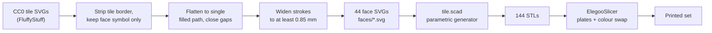
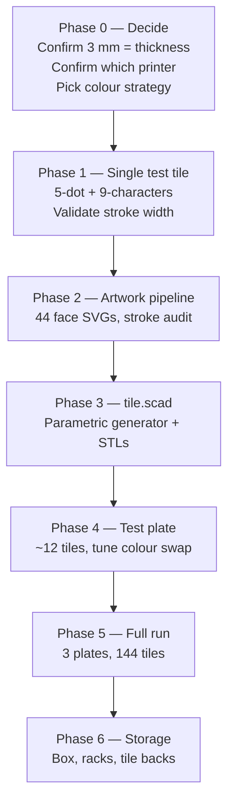

# Mahjong Tile Set

A full 144-tile mahjong set with classic symbols, printed as flat 3 mm tiles on an Elegoo Centauri Carbon with a 0.4 mm nozzle.

Status: **planning**. Nothing printed yet. This document is the design brief and roadmap.

---

## 1. The idea

Generate the whole set parametrically rather than modelling 144 tiles by hand: take a CC0 vector tile set, convert each face to an SVG path, and feed it into an OpenSCAD generator that extrudes a tile body with the face inlaid or engraved. One `.scad` file plus 44 face SVGs produces every tile, and changing the tile thickness, corner radius, or face style is a parameter change rather than a remodel.

This reuses the pattern already built in [`openSCAD/Stencil Generator`](../../../openSCAD/) (SVG → 3D with beveled edges) and the artwork conventions in [`stencils`](../../../stencils/).

---

## 2. Decision to confirm before modelling

**"3 mm high" reads as tile *thickness*, which makes this a flat tile set, not a wall-building set.**

A standard Chinese "size 32" tile is 32 × 24 × **16 mm** — the 16 mm is what lets tiles stand on edge to build the wall. At 3 mm a tile lies flat and cannot stand, so a 3 mm set plays as mahjong *solitaire* (Shanghai), as a travel/compact set, or as tiles laid face-up on the table.

Three ways forward:

| Option | Thickness | Plays as | Print cost (est.) |
| --- | --- | --- | --- |
| **A. Flat set** (as asked) | 3 mm | Solitaire, travel, face-up play | ~410 g, ~12–15 h |
| **B. Standard set** | 16 mm | Full wall-building mahjong | ~2.2 kg, ~4–5 days |
| **C. Half-height** | 8 mm | Stands in a wall, roughly half the print | ~1.1 kg, ~2 days |

**Recommendation:** build the generator with thickness as a parameter and print Option A first. You get a complete, playable-as-solitaire set in a couple of days, and if you later want a wall-building set it is a one-number change and a re-slice — no redesign. Everything below is written for Option A with that parameter in place.

**Do not scale the face down to match the thin tile.** The 32 × 24 mm face is what makes the 0.4 mm nozzle viable — see §4.

---

## 3. Printer notes

Small correction worth catching early: **there is no "Centauri Carbon 3."** The line is the original **Centauri Carbon** (256 × 256 × 256 mm, CoreXY, enclosed, 320 °C hardened nozzle, 110 °C bed) and the **Centauri Carbon 2 / 2 Combo**, launched January 2026, which adds the four-colour **CANVAS** system. CANVAS also shipped as a **$55 add-on for the original Centauri Carbon in April 2026**.

Which machine you actually have decides §5, so it is worth confirming. This plan assumes the **single-colour original Centauri Carbon** — the harder case — and notes where CANVAS makes life easier.

The 256 mm bed and enclosure both help here: large plates of small parts, and a stable chamber that keeps a thin, wide, flat part from curling at the corners.

---

## 4. Why the 0.4 mm nozzle works — but only at full face size

The binding constraint is the 萬 (*wàn*) character on the Characters suit: roughly 12 strokes stacked inside one glyph.

The rule of thumb for FDM text is that a stroke narrower than the extrusion width will not form, and **a stroke that gets fewer than two extrusion lines is likely to fail**. With a 0.4 mm nozzle at ~0.42 mm line width, that sets a floor of **≈ 0.85 mm minimum stroke width**.

| Face size | 萬 glyph height | Approx. stroke width (bold CJK) | Verdict |
| --- | --- | --- | --- |
| 32 × 24 mm | ~14 mm | ~1.0–1.2 mm | ✅ comfortable |
| 26 × 20 mm | ~11 mm | ~0.8–0.9 mm | ⚠️ marginal |
| 24 × 18 mm | ~10 mm | ~0.7–0.8 mm | ❌ strokes merge |

So: **keep the face at 32 × 24 mm**, use a heavy CJK weight (Noto Sans CJK Bold / Source Han Sans Heavy), and add a small outward offset to any glyph whose strokes measure under 0.85 mm. A 0.2 mm nozzle would lift the ceiling considerably, but at 144 tiles the print time makes that a poor trade.

Other geometry rules that follow from the nozzle:

- Embossed relief: **0.6 mm** proud of the face (3 layers at 0.2 mm)
- Engraved grooves: **≥ 0.6 mm** wide, 0.4–0.6 mm deep, if going the paint-fill route
- Gap between adjacent strokes: **≥ 0.8 mm**, or they fuse into a blob
- Corner radius 3 mm, and a 0.4 mm × 45° chamfer on the bottom edge to absorb elephant's foot

---

## 5. Getting colour onto the face

This is the real design problem, and it is worth being blunt about it: **a single-extruder printer gives you one accent colour per plate.** A pause-and-swap at a given Z changes colour for *every* object on the plate at that height. Classic tiles are not one colour — dots are blue/red/green, bamboo is green with a red bird, characters are a blue numeral over a red 萬.

Four honest options:

### 5a. Two-tone inlay — recommended first attempt
Print **face-down** on smooth PEI. The first 2 layers (0.4 mm) are the accent colour and form the symbol inlaid flush into the face; swap filament and print the remaining 2.6 mm in ivory. Result: a dead-flat, glossy, two-tone face with no painting and no post-processing, one pause per plate.

Constraint: one accent colour per plate, so either sort tiles into red / green / blue plates, or accept a single-colour face design (the minimalist "black set" look). Cheapest, fastest, and by far the most likely to look good on the first try.

### 5b. Engrave and paint-fill
Engrave the design 0.5 mm deep, flood with acrylic paint or a paint pen, wipe the surface flush before it cures. Gives full classic polychrome on a single-extruder machine. Authentic result, but it is 144 tiles of handwork — budget several evenings.

### 5c. CANVAS / Centauri Carbon 2
True four-colour, no pauses, correct classic colours straight off the plate. If you already have CANVAS this is simply the answer. If not, $55 against ~15 hours of hand-painting is a reasonable trade.

### 5d. Sorted-plate hybrid
Group tiles by dominant accent (all-red plate, all-green plate, blue/black plate) and use 5a per plate, hand-touching only the handful of genuinely two-colour faces (1-bamboo bird, the flowers). Good middle path if CANVAS is not on the table.

**Suggested sequence:** print one test tile each of 5a and 5b, look at them side by side, then commit. Do not commit 144 tiles to a colour strategy you have not held in your hand.

---

## 6. Tile inventory (144)

| Group | Symbols | Distinct | ×4 | Total |
| --- | --- | --- | --- | --- |
| Characters (萬 / craks) | 一–九 萬 | 9 | 4 | 36 |
| Bamboo (索 / sticks) | 1–9 | 9 | 4 | 36 |
| Dots (筒 / circles) | 1–9 | 9 | 4 | 36 |
| Winds | 東 南 西 北 | 4 | 4 | 16 |
| Dragons | 中 發 白 | 3 | 4 | 12 |
| Flowers | 梅 蘭 菊 竹 | 4 | 1 | 4 |
| Seasons | 春 夏 秋 冬 | 4 | 1 | 4 |
| | | **42** | | **144** |

136 without flowers and seasons. Add 4 blanks as spares — tiles get lost, and a spare is free while the plate is already running.

---

## 7. Artwork pipeline

**Source:** [FluffyStuff/riichi-mahjong-tiles](https://github.com/FluffyStuff/riichi-mahjong-tiles) — complete vector tile set, released **CC0 (public domain, no attribution required)**. This is the cleanest licence of the options; the Wikimedia Commons tile SVGs are CC BY-SA 4.0, which would drag a share-alike obligation into the repo for no benefit.

The stroke-widening step in `D` is the one that needs care — it is a per-glyph check against the 0.85 mm floor, not a blanket offset, or the dots suit will bloat.

---

## 8. Draft print settings

Starting point, to be corrected by the test plate:

| Setting | Value | Why |
| --- | --- | --- |
| Layer height | 0.16 mm | Finer steps on the inlay; 3 mm = 19 layers |
| First layer | 0.20 mm | Adhesion for a large flat footprint |
| Line width | 0.42 mm | Default for 0.4 nozzle |
| Walls | 3 | Crisp tile edges |
| Top/bottom layers | 5 / 5 | At 3 mm the tile is nearly solid regardless |
| Infill | 100 % | Weight and a solid "clack" |
| Material | PLA or PLA+ | Stiff, dimensionally stable, cheap at 144 parts |
| Bed / plate | Smooth PEI, face-down | Glossy face, closest to real melamine tiles |
| Elephant-foot comp. | 0.15–0.20 mm | Keeps the inlaid face edge sharp |
| Brim | Off, unless corners lift | Thin wide parts are the classic curl case |
| Colour change | Pause at Z = 0.36 mm | End of layer 2, for the 5a inlay |

Chamber: leave the door ajar for PLA — the enclosure is an asset for ABS but PLA will heat-creep in a sealed hot chamber.

---

## 9. Budget (estimates, not measured)

- **Per tile:** 32 × 24 × 3 mm ≈ 2.3 cm³ ≈ **2.9 g** solid PLA
- **Set:** ~410 g body filament + a small amount of accent; call it one spool with room to spare
- **Plate capacity:** ~48–63 tiles at 2–4 mm spacing → **3 plates**
- **Time:** roughly 4–5 h per plate, **~12–15 h total**

Reality check on feel: a real size-32 tile is ~18 g. A 3 mm flat tile is ~2.9 g. **These will feel notably light** — that is inherent to Option A, not a settings problem. If heft matters, that is an argument for Option C (8 mm) or for a rear cavity holding a steel washer.

---

## 10. Roadmap

**Phase 0 — Decide.** Three answers unblock everything: is 3 mm the thickness, which Centauri Carbon is it, and which colour route from §5.

**Phase 1 — One test tile.** Print **9-characters** (the densest glyph) and **5-dots** at full 32 × 24 mm. This is the entire technical risk of the project in a 20-minute print. If 九萬 comes out legible, nothing else here is hard.

**Phase 2 — Artwork.** Extract 44 faces from the CC0 set, strip borders, flatten to filled paths, audit every glyph against the 0.85 mm floor. The slowest phase and the one that decides how good the set looks.

**Phase 3 — Generator.** `tile.scad` with parameters for size, thickness, corner radius, chamfer, relief depth, and face style (emboss / engrave / inlay). Batch-export 144 STLs.

**Phase 4 — Test plate.** ~12 tiles covering every suit. Tune the colour-swap Z, elephant-foot compensation, and spacing. Confirm no corner lift across a full-width plate.

**Phase 5 — Full run.** Three plates. Sort by accent colour if going the 5d route.

**Phase 6 — Storage.** A box and racks, once tile dimensions are final and measured rather than nominal.

---

## 11. Risks

| Risk | Likelihood | Mitigation |
| --- | --- | --- |
| 萬 strokes merge at 0.4 mm | Medium | Phase 1 test tile settles it before any bulk work |
| Thin flat tiles curl at corners | Medium | Enclosure, smooth PEI, brim if needed, chamfered bottom |
| One accent colour per plate | Certain | §5 — pick a strategy deliberately, do not discover it mid-run |
| Tiles feel too light | Certain at 3 mm | Accept, or thicken, or add washer cavity |
| Colour-swap pause fails mid-plate | Low | Test on the Phase 4 plate, not the 63-tile plate |

## 12. Open questions

1. Is 3 mm the thickness, or did you mean the symbol relief height?
2. Centauri Carbon, Centauri Carbon 2, or original + CANVAS?
3. Solitaire/travel set, or do you want to build walls (→ Option B or C)?
4. Classic polychrome, or is a clean two-tone set acceptable?
5. Chinese, Hong Kong, or Riichi face conventions? (Affects flowers and the 白 dragon — blank vs framed.)

---

## Sources

- [Elegoo Centauri Carbon — official product page](https://us.elegoo.com/products/centauri-carbon)
- [Elegoo Centauri Carbon 2 Combo launch (Jan 2026)](https://tools.prnewswire.com/en-us/live/20813/release/20260119EN65865)
- [CANVAS multi-colour system for Centauri Carbon](https://www.creativebloq.com/3d/elegoo-launches-the-multi-colour-system-long-promised-for-its-best-selling-centauri-carbon-3d-printer)
- [World Mahjong Organization tile size standard](https://www.chinadaily.com.cn/china/2011-11/24/content_14150841.htm)
- [Mahjong tile size guide](https://mahjongplaybook.com/american-majong/mahjong-tile-size-guide/)
- [FluffyStuff/riichi-mahjong-tiles — CC0 vector tiles](https://github.com/FluffyStuff/riichi-mahjong-tiles)
- [Wikimedia Commons mahjong tile SVGs (CC BY-SA 4.0)](https://commons.wikimedia.org/wiki/Category:SVG_illustrations_of_Mahjong_tiles)
- [Readable 3D printed text — best practices](https://mandarin3d.com/blog/text-and-engravings-best-practices-for-readable-3d-printed-text)
- [FFF design rules — minimum feature size](https://www.hydraresearch3d.com/design-rules)
